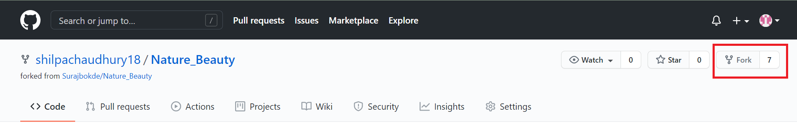
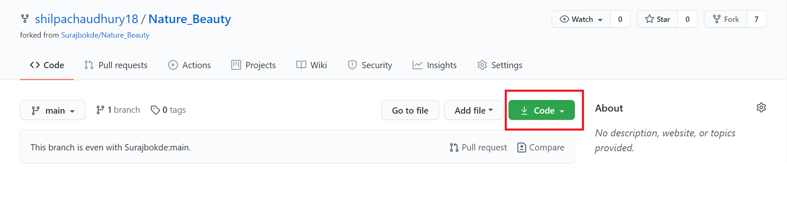
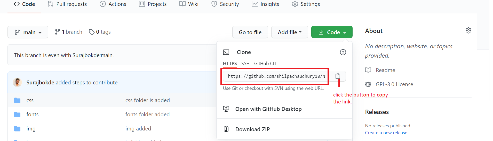
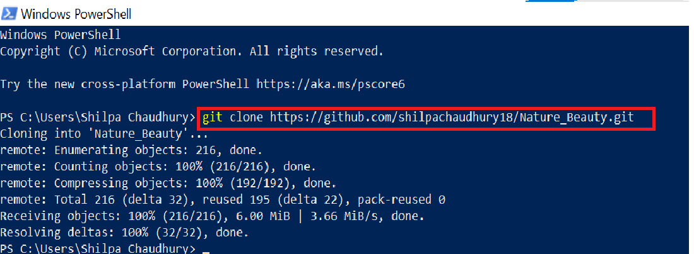
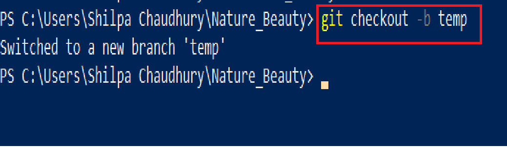

# Nature_Beauty (WEB APP) 

---

  

🎉First off All, thanks for taking the time out of your schedule and deciding to contribute here!👍

## Assistance to get started:page_facing_up:

If you're new to contributing and have no idea about working with repositories, be sure to check [GitHub docs to getting started](https://docs.github.com/en/free-pro-team@latest/github/getting-started-with-github) from GitHub may also be helpful to refer.

## Steps to Contribute in GitHub Repository:pushpin:

***If you don't have git on your machine, [install it](https://help.github.com/articles/set-up-git/).***

Step by step details for sending a Pull Request-
To Fork the Repo on GitHub, please click on the Fork button at the top right corner of the page.

Once you are in the Fork, please click on the Code button displayed in green.

Once the Code window has opened, please click on the Copy button.

Now we need to open the Terminal. Once the Terminal window opens, you will be able to see the user name and the corresponding path of the folder. The cursor will be by default pointing there. Please write `git clone <URL>` where the cursor will be pointing and then  paste the link that was previously copied.

0. Change directory to Nature Beauty: `cd Nature_Beauty`.

1. Make a new branch using the command `git checkout -b <branch name>`. 

2. Make Changes to the required files in the local folder. Check status of the changed files using `git status`.
3. Send the required file to the staging area using `git add <file_names>`. 
4. Make a commit: `git commit -m <commit message>`.
5. Push the changes to GitHub using `git push origin <branch name>`.
6. Click on send a pull request on GitHub.

- **Fork the Repo and star ( for better reach)** 
 - `git init` 
 - `git clone <Https link>`
 - It will download all file to your desktop
 - Now make the changes
 - `git status`
 - It will show all the changes you made
 - now add the file by using 
 - `git add filename` or `git add .`
 - commit it by meaningful message
 - `git commit -m "your message"`
 - now you are ready to push but before that pull all the changes first
 - `git pull https://github.com/Surajbokde/Nature_Beauty.git`
 - now push the changes
 - `git push origin`
 - now make a pull request and add screenshot of changes you did.
 

### So, what are you waiting for? Begin contributing now! :fire: :rocket:

#### All the Best!🥇
